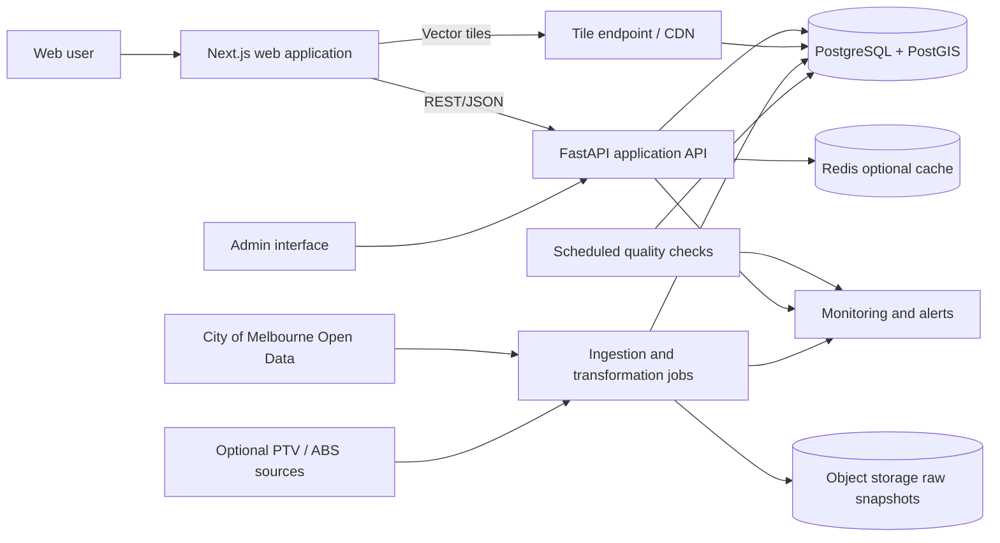
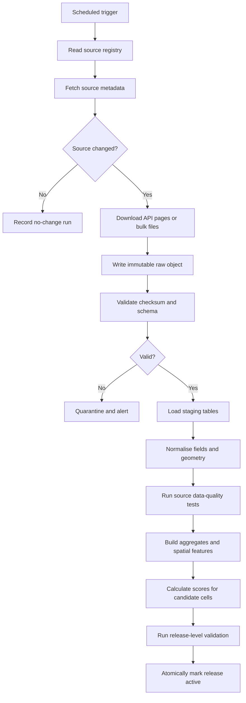
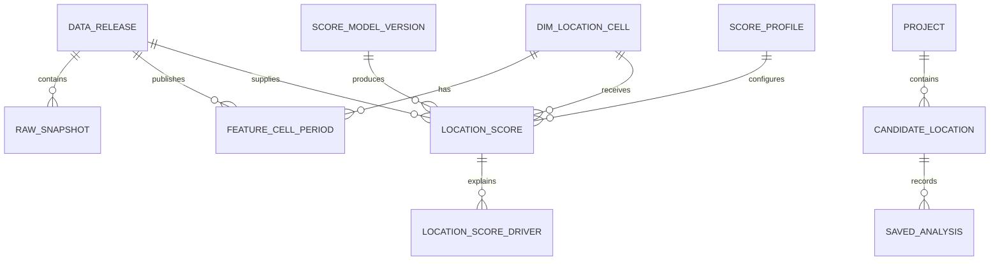

# RetailScout — City of Melbourne Architecture

## 1. Executive summary

RetailScout is a location-intelligence web application that helps a prospective operator compare places to open a café, retail shop, food truck or pop-up within the City of Melbourne.

The first release should answer:

> “How suitable is this location for my type of business, what evidence supports that result, and how reliable is the available data?”

The recommended first architecture is a **modular monolith with a separate ingestion worker**:

- **Next.js + TypeScript** web application
- **FastAPI + Python** application API and scoring service
- **PostgreSQL + PostGIS** as the analytical and transactional database
- **Object storage** for immutable raw source snapshots
- Scheduled ingestion jobs that retrieve City of Melbourne Open Data
- Precomputed geospatial features and scores at a small hexagonal-grid level
- **MapLibre GL JS** for the interactive map
- Vector tiles generated from PostGIS for fast score-layer rendering

The application should not query City of Melbourne APIs during normal user requests. Council datasets should be copied, versioned, validated and transformed into RetailScout's own data model. This provides predictable latency, historical reproducibility, schema-drift protection and resilience when upstream datasets are unavailable.

The MVP should use an explainable weighted scoring model rather than machine learning. Every result should expose:

1. Overall suitability score
2. Component scores
3. Supporting facts
4. Data freshness
5. Coverage/confidence rating
6. Known limitations

A location score must be presented as a decision-support signal, not a revenue forecast or guarantee of business success.

---

## 2. Scope

### 2.1 Geographic scope

The initial supported geography is the **City of Melbourne municipality**, including its CBD and surrounding municipal small areas.

All candidate locations must fall inside the current municipal boundary. The system should nevertheless avoid hard-coding City of Melbourne concepts into its core domain model so that another local government area can be added later.

### 2.2 Supported business profiles

The MVP supports four configurable profiles:

- Café
- Retail shop
- Food truck
- Pop-up shop

A profile changes:

- Relevant dayparts and days of week
- Industry classifications treated as competitors
- Industries treated as complementary destinations
- Scoring weights
- Catchment distances
- Required evidence displayed to the user

### 2.3 MVP questions

The product should help users answer:

- How much pedestrian activity is near the location?
- Is activity concentrated on weekdays, weekends, mornings, lunch or evenings?
- How many workers are in the surrounding area?
- Which similar and complementary businesses are nearby?
- Does the area appear saturated or established as a destination cluster?
- Are major residential, office, retail or hospitality developments planned nearby?
- How walkable and transport-accessible is the site?
- Is on-street parking available nearby?
- How does this location compare with other shortlisted locations?
- How fresh and reliable is each input?

### 2.4 Explicitly out of scope for the first release

- Predicting sales, profit, rent or business survival
- Commercial lease listings and asking rents
- Unit-level vacancy or tenancy availability
- Planning-permit or food-business permit approval
- Detailed demographic segmentation from ABS Census
- Mobile-phone movement data
- Card-spend or transaction data
- Tourism visitation data from commercial providers
- Real-time event attendance
- Nationwide coverage
- Automated investment advice

These can be added later, but the interface and database should leave room for them.

---

## 3. Product requirements

### 3.1 Primary personas

#### Prospective small-business owner

Needs a simple comparison of candidate areas without GIS or analytics knowledge.

#### Existing operator considering a second site

Needs richer competitive, temporal and worker-demand evidence, plus the ability to compare several addresses.

#### Food-truck or pop-up operator

Needs time-specific activity, access, parking/kerb information and short-duration opportunity signals.

#### Commercial property or business adviser

Needs repeatable reports, source citations and transparent assumptions.

### 3.2 Core user journeys

#### Explore the city

1. Select a business profile.
2. Adjust opening days and dayparts.
3. View a heatmap of suitability.
4. Filter by small area, score or data confidence.
5. Open a location to inspect evidence.

#### Score an address

1. Enter an address or click the map.
2. Confirm the candidate point.
3. Receive overall and component scores.
4. Inspect nearby sensors, businesses, jobs and developments.
5. Save the location to a project.

#### Compare locations

1. Add two to five candidate locations.
2. Compare component scores and raw metrics.
3. View major trade-offs.
4. Export or share a report.

### 3.3 MVP functional requirements

| ID | Requirement |
|---|---|
| FR-01 | Search for an address and select a point on the map. |
| FR-02 | Reject or clearly flag points outside the supported municipal boundary. |
| FR-03 | Select café, retail, food-truck or pop-up scoring profiles. |
| FR-04 | Select intended trading days and dayparts. |
| FR-05 | Display a city-wide suitability layer. |
| FR-06 | Return overall, component and confidence scores for a selected location. |
| FR-07 | Display hourly/daypart pedestrian patterns and trends. |
| FR-08 | Show nearby competitors and complementary businesses by category. |
| FR-09 | Show estimated worker demand by walking catchment. |
| FR-10 | Show nearby major developments, status and expected scale. |
| FR-11 | Show walking-network, transport and parking-access indicators. |
| FR-12 | Explain the largest positive and negative score drivers. |
| FR-13 | Display source, observation period and last-refresh date for every metric. |
| FR-14 | Save candidate locations and compare them in a project. |
| FR-15 | Export a concise PDF later; the MVP may begin with a printable web report. |
| FR-16 | Allow administrators to publish a new score-model version without redeploying the frontend. |
| FR-17 | Preserve the score version and data snapshot used for saved analyses. |

### 3.4 Non-functional requirements

| Area | Initial target |
|---|---|
| Point-score latency | p95 below 800 ms when features are precomputed |
| Map-tile latency | p95 below 500 ms when cached |
| Availability | 99.5% monthly for public beta |
| Accessibility | WCAG 2.2 AA target |
| Browser support | Current Chrome, Safari, Firefox and Edge; responsive mobile layout |
| Data reproducibility | Every score references a model version and source snapshot |
| Security | TLS, least-privilege access, managed secrets, rate limiting and audited admin changes |
| Privacy | Anonymous use by default; collect only data needed for accounts and saved projects |
| Data quality | Automated schema, freshness, uniqueness, coordinate and volume checks |
| Recovery | Daily database backups; raw source snapshots retained separately |
| Observability | Structured logs, request traces, errors, job status and source-freshness alerts |

---

## 4. City of Melbourne data foundation

The City of Melbourne portal exposes datasets through the Huwise/OpenDataSoft Explore API. A typical records endpoint is:

```text
https://data.melbourne.vic.gov.au/api/explore/v2.1/catalog/datasets/{dataset_id}/records
```

Useful query parameters include `select`, `where`, `group_by`, `order_by`, `limit` and `offset`. Bulk files should be used for large historical loads when available; the records API is suitable for metadata checks and incremental retrieval.

### 4.1 Required datasets

| Capability | Dataset | Identifier | Source cadence | RetailScout use |
|---|---|---|---|---|
| Historical foot traffic | Pedestrian Counting System — counts per hour | `pedestrian-counting-system-monthly-counts-per-hour` | Monthly | Daypart demand, weekday/weekend pattern, seasonality and trend |
| Pedestrian sensor geography | Pedestrian Counting System — Sensor Locations | `pedestrian-counting-system-sensor-locations` | As changed | Sensor location, status and relocation history |
| Recent multimodal activity | Transport Activity Counts | `transport-activity-counts` | Hourly; history from 2023 | Five-minute pedestrian, cyclist, e-scooter and vehicle activity near monitored corridors |
| Business points | Business establishments location and industry classification | `business-establishments-with-address-and-industry-classification` | Annual | Competitor and complementary-business locations using ANZSIC4 |
| Café capacity | Café, restaurant, bistro seats | `cafes-and-restaurants-with-seating-capacity` | Annual | Hospitality competition and market-capacity proxy |
| Worker population | Jobs per CLUE industry for blocks | `employment-by-block-by-clue-industry` | Annual | Worker-demand catchments and industry mix |
| Establishment density | Business establishments per ANZSIC for blocks | `business-establishments-per-block-by-anzsic` | Annual | Block-level market density and historical trend |
| Spatial unit | Blocks for CLUE | `blocks-for-census-of-land-use-and-employment-clue` | As changed | Join CLUE block facts to geometry |
| Development pipeline | Development Activity Monitor | `development-activity-monitor` | Monthly | Nearby planned, approved, under-construction and recently completed supply |
| Walking access | Pedestrian Network | `pedestrian-network` | Irregular | Network-distance catchments and route-aware proximity |
| Parking access | On-street Parking Bays | `on-street-parking-bays` | Static/use with caveats | Nearby bay density and spatial access proxy |
| Current parking condition | On-street Parking Bay Sensors | `on-street-parking-bay-sensors` | Real time | Optional live or historical parking-availability indicator |
| Local transport geometry | Bus stops, tram tracks and City Circle stops | Various | Irregular | Initial access proxy if using only council sources |

### 4.2 Important source limitations

#### Pedestrian coverage is sparse

Sensors measure specific points, not every street. A nearby sensor count must not be presented as the exact footfall at a candidate storefront. RetailScout should distinguish:

- **Observed foot traffic** at a sensor
- **Interpolated local activity** for a candidate cell
- **Coverage confidence** based on distance, network relationship, sensor quality and recency

#### Sensor locations change

Historical counts must be joined to the correct sensor-location period. A sensor identifier cannot automatically be treated as one fixed physical location for all time.

#### Missing transport records are ambiguous

The Transport Activity Counts dataset may not contain a five-minute record for every road-user type and interval. Missing observations must not automatically be converted to zero.

#### CLUE data is annual

CLUE is unusually valuable but is not live. The business-establishment and employment datasets currently cover observations through 2024. Results must display the census year.

#### Suppressed employment cells

Some detailed employment cells are suppressed to protect commercially sensitive information. RetailScout must preserve suppression and must not attempt to reverse-engineer hidden values.

#### CLUE boundaries changed

The council states that CLUE block boundaries were realigned during 2025. Store historical geometry versions and do not assume that a block identifier or shape is perfectly stable across all years.

#### Parking data has caveats

The mapped-bay dataset acknowledges incomplete and potentially outdated coverage. Parking should be a low-weight supporting measure, not a decisive score component.

#### Development data is indicative

Development status and timing can change. Display the source status and date, and avoid representing planned developments as certain future demand.

### 4.3 Recommended second-wave public data

The initial geography can remain City of Melbourne while adding non-council public sources:

- Transport Victoria/PTV GTFS for complete train, tram and bus stops, routes and service frequency
- ABS Census and Data Explorer outputs for resident population and demographics
- VicPlan/planning-scheme layers for zoning and overlays
- Victorian planning applications and permits where reusable data is available
- OpenStreetMap or a licensed map provider for basemap and address context

For a credible transport-access score, complete PTV data is preferable to council-only bus and tram layers. If PTV is deferred, label the initial transport measure as an incomplete proxy.

---

## 5. Architecture principles

1. **Local copy, not pass-through API**  
   Council services are ingestion sources, not runtime dependencies.

2. **Raw data is immutable**  
   Retain every downloaded source file with retrieval time, checksum and metadata.

3. **Scores are versioned products**  
   Store the score definition, input snapshot and resulting values.

4. **Explainability over false precision**  
   Show component metrics, percentiles and confidence rather than an unexplained number.

5. **Geospatial work is precomputed**  
   Expensive joins and catchments run in jobs, not on every browser request.

6. **One deployable API initially**  
   Avoid microservices until scale or team boundaries justify them.

7. **Temporal context is first-class**  
   A café at 8 am and a pop-up at 7 pm should not receive the same demand score.

8. **Missing is not zero**  
   Preserve source missingness, suppression and sensor outages.

9. **Data confidence is part of the product**  
   Never hide sparse coverage behind a polished heatmap.

10. **The design must support another municipality later**  
    Place source-specific mapping in ingestion adapters rather than core application logic.

---

## 6. High-level system architecture



### 6.1 Runtime components

#### Web application

Responsibilities:

- Map and score visualisation
- Address/click selection
- Business-profile configuration
- Comparison and report UI
- Anonymous session handling
- Authenticated saved projects
- Data-source and methodology explanations

#### Application API

Responsibilities:

- Candidate validation
- Score retrieval
- Nearby evidence queries
- Project and saved-location CRUD
- Admin score-version management
- Authorisation, rate limiting and audit events
- Serving map-layer metadata

#### PostgreSQL/PostGIS

Responsibilities:

- Geospatial source data
- Processed observations and aggregates
- Feature store
- Precomputed scores
- Projects and users
- Provenance and job metadata
- Vector-tile queries

#### Ingestion worker

Responsibilities:

- Download source metadata and files
- Persist immutable raw snapshots
- Validate schemas
- Normalise source fields
- Maintain geometry versions
- Aggregate temporal observations
- Build catchment features
- Calculate scores
- Publish a new data release atomically

#### Object storage

Responsibilities:

- Raw CSV, JSON, GeoJSON and ZIP snapshots
- Checksums and manifests
- Failed-record quarantine
- Optional report exports

#### Cache/CDN

Use CDN caching for public vector tiles and static assets. Add Redis only when query volume demonstrates a need; PostgreSQL plus HTTP caching is enough for an MVP.

---

## 7. Recommended technology stack

### 7.1 Application stack

| Layer | Recommendation | Rationale |
|---|---|---|
| Frontend | Next.js, TypeScript, React | Strong ecosystem, server rendering, routing and typed UI |
| Map | MapLibre GL JS | Open rendering stack and vector-tile support |
| Optional map analytics | deck.gl | Add only for dense point or animated temporal layers |
| API | FastAPI, Python, Pydantic | Good fit for geospatial/data logic and typed contracts |
| Database | PostgreSQL with PostGIS | Mature spatial functions, indexing and analytical SQL |
| ORM/query layer | SQLAlchemy 2.x plus explicit SQL for spatial queries | Avoid hiding complex PostGIS operations |
| Migrations | Alembic | Version-controlled schema changes |
| Dataframes | Polars or PyArrow | Efficient transformation of bulk files |
| Geospatial processing | GeoPandas, Shapely, pyproj | Familiar ETL tooling; use PostGIS for serving |
| Network analysis | pgRouting or NetworkX | Start with precomputed walking catchments; choose based on network size |
| Grid | H3 or generated PostGIS hex grid | Stable map cells and fast comparison |
| Jobs | Python CLI jobs scheduled by platform scheduler | Simpler than adopting Airflow for a small number of pipelines |
| Data tests | Pytest plus SQL-based assertions | Code and warehouse validation |
| Object storage | S3-compatible bucket | Raw snapshots and manifests |
| Contracts | OpenAPI-generated TypeScript client | Backend/frontend type alignment |
| Monitoring | OpenTelemetry and Sentry-compatible error tracking | Request, job and frontend visibility |

### 7.2 Deployment options

#### Lowest-operations MVP

- Vercel or equivalent for Next.js
- Managed FastAPI container platform
- Supabase or another managed PostgreSQL service with PostGIS
- S3-compatible object storage
- GitHub Actions for CI and scheduled low-frequency jobs

#### Recommended scalable reference deployment

- Containerised web and API
- Managed container service in an Australian region
- Managed PostgreSQL with PostGIS
- Managed object storage
- Managed scheduler invoking ingestion containers
- CDN in front of static assets and public vector tiles
- Infrastructure as code using Terraform

Do not design a Kubernetes platform for the MVP.

---

## 8. Data ingestion and release architecture



### 8.1 Source registry

Maintain a configuration table or version-controlled YAML file with:

```yaml
id: pedestrian_hourly
provider: city_of_melbourne
remote_dataset_id: pedestrian-counting-system-monthly-counts-per-hour
fetch_mode: api_or_bulk
expected_cadence: monthly
primary_keys:
  - sensor_id
  - sensing_date
  - hour
geometry: none
licence: CC BY
owner: data-platform
```

The registry should also contain:

- API URL template
- Schema version
- Cursor or incremental field when available
- Time zone
- Expected minimum and maximum row-volume changes
- Source-specific null semantics
- Required attribution
- Data-quality owner

### 8.2 Raw snapshot layout

```text
raw/
  city_of_melbourne/
    pedestrian_hourly/
      retrieved_date=2026-07-25/
        metadata.json
        manifest.json
        data-0001.jsonl.gz
    business_establishments/
      source_year=2024/
        retrieved_date=2026-07-25/
          data.parquet
```

Each manifest records:

- Retrieval timestamp in UTC
- Source URL and dataset identifier
- HTTP response metadata
- Source modification time when supplied
- Record count
- File checksum
- Schema fingerprint
- Ingestion software version

### 8.3 Refresh strategy

| Source type | Retrieval | Transformation | Score refresh |
|---|---|---|---|
| Five-minute transport activity | Hourly incremental | Hourly; roll up to hour/daypart | Daily or hourly for “current activity” layer |
| Historical pedestrian counts | Monthly | Monthly | Monthly |
| Sensor locations | Daily metadata check | On change | On change |
| CLUE businesses/jobs/seats | Weekly metadata check | On annual release | On release |
| Development monitor | Monthly | Monthly | Monthly |
| Parking sensors | Optional 5–15 minute ingestion | Hourly aggregates | Hourly/current layer |
| Static spatial layers | Monthly metadata check | On change | On change |

### 8.4 Publication model

Never update active feature tables row by row while users are querying them. Build a complete `data_release`, validate it, then atomically switch an `active_release_id` pointer.

This enables:

- Rollback
- Reproducible saved reports
- Zero-partial-release behaviour
- A/B comparison of score versions

---

## 9. Geospatial model

### 9.1 Analysis grid

Create a hexagonal grid clipped to the City of Melbourne boundary. Use H3 or a generated PostGIS hex grid at approximately block-face scale.

Each cell stores:

- Stable cell identifier
- Centroid
- Polygon
- Municipality
- CLUE block and small area where applicable
- Nearest pedestrian-network node
- Land/water eligibility flag
- Data-coverage flags

Why a grid:

- City-wide heatmaps can be precomputed
- Candidate locations receive stable comparable features
- Vector tiles are smaller than rendering every raw source point
- Scores can be cached by cell, profile and temporal configuration
- New municipalities can use the same abstraction

The exact resolution should be benchmarked. A cell should be small enough to distinguish opposite ends of a retail block but not imply storefront-level precision unsupported by source data.

### 9.2 Catchments

Use multiple catchments because different signals operate at different scales:

- 100–200 m: immediate frontage and direct competitors
- 400 m walking distance: convenient local catchment
- 800 m walking distance: broader destination/worker catchment

Prefer network-distance catchments using the City pedestrian network. If the network cannot be maintained reliably, begin with geodesic buffers and label them as approximate.

### 9.3 Spatial assignment rules

- Point businesses: network or straight-line distance to cell centroid
- Jobs: allocate block totals to intersecting cells, or query whole blocks within a walking catchment
- Developments: use supplied point/geometry; retain status and proposed use
- Pedestrian sensors: retain observed point; derive local interpolated activity separately
- Parking bays: count and distance, with quality caveat
- Transport stops: distance plus service-frequency features when PTV data is introduced

### 9.4 Required indexes

```sql
CREATE INDEX idx_location_cell_geom
ON dim_location_cell USING GIST (geom);

CREATE INDEX idx_business_geom
ON dim_business_establishment USING GIST (geom);

CREATE INDEX idx_sensor_geom
ON dim_sensor_location USING GIST (geom);

CREATE INDEX idx_development_geom
ON fact_development_snapshot USING GIST (geom);

CREATE INDEX idx_feature_lookup
ON feature_cell_period (cell_id, period_key, data_release_id);
```

---

## 10. Pedestrian-activity methodology

Foot traffic is the most valuable and most easily overstated input.

### 10.1 Sensor processing

For every sensor and hour:

1. Parse local Melbourne date and time.
2. Join to the valid sensor-location interval.
3. Preserve observed zero separately from missing data.
4. Flag outages, duplicate intervals and implausible spikes.
5. Generate day type: weekday, Saturday, Sunday/public-holiday where available.
6. Generate business dayparts.
7. Aggregate using robust statistics.

Suggested café dayparts:

- Morning: 06:00–10:00
- Lunch: 11:00–14:00
- Afternoon: 14:00–17:00
- Evening: 17:00–22:00

Store raw definitions in configuration so they can change without rewriting data.

### 10.2 Baseline features

Per sensor, day type and daypart:

- Median hourly count over trailing 12 months
- Mean and trimmed mean
- 25th and 75th percentiles
- Observation coverage percentage
- Month-over-month and year-over-year trend
- Weekday/weekend ratio
- Morning/lunch/evening mix
- Seasonal stability
- Recent 28-day deviation where recent data supports it

### 10.3 Candidate-location interpolation

For a candidate cell, identify eligible sensors within a maximum walking distance. Compute a distance-decay estimate such as:

```text
weight_i = exp(-network_distance_i / decay_distance)
           × sensor_quality_i
           × street_relationship_i
```

Then calculate a weighted median or robust weighted mean.

`street_relationship_i` may initially be 1.0 for all sensors. Later it can favour:

- Same pedestrian corridor
- Same block face
- Uninterrupted walking route
- Similar local land-use pattern

Do not display the result as “pedestrians passing this shop”. Use wording such as:

> “Modelled nearby pedestrian activity based on three sensors within a 650 m walking catchment.”

### 10.4 Foot-traffic confidence

Calculate a separate confidence value using:

- Distance to nearest sensor
- Number of nearby sensors
- Observation completeness
- Sensor recency and active status
- Agreement among nearby sensors
- Whether the candidate and sensor share a plausible pedestrian corridor

Example bands:

- High: strong nearby observed coverage
- Medium: usable but interpolated
- Low: distant or inconsistent sensors
- Insufficient: no defensible estimate

A low-confidence location should remain visible but should not receive a visually authoritative foot-traffic score.

---

## 11. Business and competition methodology

### 11.1 Industry taxonomy

Create a RetailScout taxonomy that maps ANZSIC4 descriptions and codes into user-facing categories.

Example:

```text
Hospitality
  Cafe
  Restaurant
  Takeaway
  Bar
Retail
  Grocery
  Fashion
  Pharmacy
  Convenience
Services
  Office
  Health
  Education
```

Do not embed category matching in application code. Store versioned mappings in a table or YAML configuration.

### 11.2 Competitor versus complementary business

The same nearby business can be:

- A direct competitor
- Evidence of an established destination cluster
- A complementary demand generator
- Neutral

Therefore, do not use “number of competitors” as a simple negative score.

Maintain separate measures:

- **Cluster strength**: evidence that consumers already visit the precinct for this category
- **Saturation risk**: competitors relative to estimated demand
- **Complementary density**: nearby businesses that support cross-shopping
- **Diversity**: mix of categories rather than one-dimensional concentration

For a café:

- Direct competitors: cafés, takeaway coffee and some bakery categories
- Complementary: offices, education, accommodation, retail and transport nodes
- Capacity pressure: competitor count and total café seats

### 11.3 Market-gap proxy

A transparent first formula:

```text
market_gap = demand_percentile - saturation_percentile
```

where demand is built from pedestrian, worker and destination signals, and saturation is built from same-category establishments and capacity.

Show both underlying values. A negative gap does not necessarily mean “bad”; it may describe a proven but competitive precinct.

---

## 12. Worker-demand methodology

Use CLUE jobs by block and industry.

For each cell and walking catchment:

- Total jobs
- Hospitality-relevant weekday worker demand
- Industry mix
- Office/professional job share
- Education, health, accommodation and retail job shares
- Historical job growth where comparable block geography is available

Because detailed cells can be suppressed:

- Preserve source null/suppression flags
- Prefer reported block totals for total jobs
- Do not sum a mixture of true totals and partially suppressed categories without labelling the result
- Give lower confidence to industry-composition estimates with substantial suppression

For the MVP, worker population is a **daytime demand proxy**, not a count of people physically present on a particular day.

---

## 13. Development-opportunity methodology

For each development near a candidate location, retain:

- Status
- Development type
- Proposed dwellings
- Proposed office, retail, hospitality or other floor area where supplied
- Location
- Source update date
- Completion timing where supplied

Create separate measures:

- Under-construction demand uplift
- Approved/planned potential uplift
- Recently completed uplift
- Construction disruption risk

Use status reliability factors. For example, an under-construction project can receive more weight than a mooted project. Do not convert all pipeline records into guaranteed future population.

Example conceptual weighting:

```text
weighted_development_value = project_scale
                             × status_probability_factor
                             × distance_decay
                             × relevance_to_business_profile
```

The factors must be configuration, not hidden constants.

---

## 14. Access methodology

### 14.1 Walking access

Measures:

- Pedestrian-network connectivity
- Number of reachable network links/intersections
- Walking distance to major activity corridors
- Barrier penalties where represented

### 14.2 Public transport

For the strict City-data MVP:

- Distance to council-mapped bus stops
- Distance to tram tracks and City Circle stops

This is incomplete. The recommended improvement is PTV GTFS with:

- Complete stops
- Route count
- Scheduled departures by daypart
- Train-station proximity
- Transfer opportunities

### 14.3 Parking and kerb access

Measures:

- Number of mapped bays within short walking distance
- Distance to nearest mapped bay
- Optional historical occupancy/availability profile

For food trucks, do not infer legal trading eligibility from parking or kerb data. Permits, road rules, loading zones and event permissions require separate validation.

---

## 15. Scoring engine

### 15.1 Design goals

- Explainable
- Deterministic
- Versioned
- Profile-specific
- Temporal
- Robust to missing inputs
- Easy to validate with domain experts

### 15.2 Normalisation

Raw values have incompatible scales. Convert each metric to a robust 0–100 percentile within the supported geography and relevant comparison cohort.

Prefer:

- Winsorisation before scaling
- Percentile rank or robust z-score
- Separate normalisers by day type/daypart where needed
- Stored transformation parameters per score version

Avoid min-max scaling on unbounded outliers.

### 15.3 Initial component model

Recommended user-facing components:

1. Pedestrian demand
2. Worker demand
3. Market fit
4. Complementary destinations
5. Growth pipeline
6. Access
7. Data confidence

Confidence should not be blended invisibly into suitability. Show it separately and optionally apply a conservative shrinkage toward the city median when confidence is low.

### 15.4 Example default profile weights

These are starting hypotheses to validate, not final truth.

| Component | Café | Retail shop | Food truck | Pop-up |
|---|---:|---:|---:|---:|
| Pedestrian demand | 25 | 25 | 30 | 25 |
| Worker/daypart demand | 20 | 10 | 15 | 10 |
| Market fit | 15 | 15 | 10 | 15 |
| Complementary destinations | 10 | 15 | 10 | 15 |
| Growth pipeline | 10 | 10 | 5 | 10 |
| Public-transport/walking access | 15 | 15 | 10 | 15 |
| Parking/kerb access | 5 | 10 | 20 | 10 |
| **Total** | **100** | **100** | **100** | **100** |

### 15.5 Score calculation

```text
component_score_j = transformed metric bundle for component j

suitability_score = sum(weight_j × component_score_j) / sum(active_weight_j)
```

Missing components:

- Do not silently treat them as zero.
- Reweight only when enough evidence remains.
- Record the missing inputs.
- Reduce confidence.
- If critical evidence is absent, withhold the overall score.

### 15.6 Score version

A score version stores:

- Version identifier
- Profile weights
- Daypart definitions
- Catchment radii
- Industry mappings
- Transformation parameters
- Development status factors
- Sensor interpolation settings
- Code commit SHA
- Training/validation notes if a learned model is later used

### 15.7 Explainability output

Return:

- Top three positive drivers
- Top three risks or weaknesses
- Raw supporting values
- Relevant city percentiles
- Source dates
- Confidence reasons

Example:

> Strong weekday morning activity and high nearby office employment support a café. Competition is also high: 18 café or takeaway-food establishments and approximately 620 reported hospitality seats are within the selected catchment. Foot-traffic confidence is medium because the nearest active pedestrian sensor is 430 m away.

---

## 16. Core database design

### 16.1 Source and provenance

```text
source_dataset
source_schema_version
ingestion_run
raw_snapshot
source_record_issue
data_release
```

### 16.2 Spatial dimensions

```text
dim_municipality
dim_small_area
dim_clue_block
dim_location_cell
dim_pedestrian_network_node
dim_transport_stop
dim_parking_bay
```

### 16.3 Observations

```text
dim_sensor
dim_sensor_location_period
fact_pedestrian_count_hourly
fact_transport_activity_5m
fact_transport_activity_hourly
fact_business_establishment_snapshot
fact_cafe_seating_snapshot
fact_employment_block_snapshot
fact_development_snapshot
fact_parking_status
```

### 16.4 Features and scores

```text
feature_cell_period
feature_cell_business_profile
score_profile
score_model_version
location_score
location_score_driver
```

### 16.5 Product tables

```text
app_user
anonymous_session
project
candidate_location
saved_analysis
share_link
audit_event
```

### 16.6 Simplified relationship diagram



### 16.7 Data retention

- Keep immutable raw snapshots indefinitely while licence and cost permit.
- Keep five-minute observations in object storage; retain a configurable recent window in PostgreSQL.
- Keep hourly/daypart aggregates in PostgreSQL.
- Keep every published score release referenced by a saved analysis.
- Set explicit retention for anonymous sessions and analytics identifiers.

---

## 17. API design

Use `/v1` REST endpoints with OpenAPI contracts.

### 17.1 Public analysis endpoints

```http
GET /v1/coverage
GET /v1/business-profiles
GET /v1/search/geocode?q=...
GET /v1/locations/score?lat=...&lon=...&profile=cafe
GET /v1/locations/evidence?lat=...&lon=...&profile=cafe
POST /v1/locations/compare
GET /v1/areas/rank?profile=cafe&daypart=morning
GET /v1/tiles/suitability/{z}/{x}/{y}.mvt
GET /v1/methodology/score-versions/{version}
GET /v1/data-sources/status
```

### 17.2 Project endpoints

```http
POST   /v1/projects
GET    /v1/projects/{project_id}
PATCH  /v1/projects/{project_id}
POST   /v1/projects/{project_id}/locations
DELETE /v1/projects/{project_id}/locations/{location_id}
POST   /v1/projects/{project_id}/share-links
```

### 17.3 Example score response

```json
{
  "location": {
    "lat": -37.814,
    "lon": 144.963,
    "cell_id": "example-cell"
  },
  "profile": "cafe",
  "score": 78.4,
  "confidence": {
    "score": 66,
    "band": "medium",
    "reasons": [
      "Three pedestrian sensors within the configured catchment",
      "Nearest sensor is 430 metres away",
      "Business and employment data are from the 2024 CLUE release"
    ]
  },
  "components": [
    {
      "key": "pedestrian_demand",
      "score": 84,
      "weight": 25,
      "evidence": {
        "weekday_morning_percentile": 88,
        "trend_year_on_year_percent": 4.2
      }
    }
  ],
  "score_version": "cafe-v1.0.0",
  "data_release": "melbourne-2026-07-25",
  "generated_at": "2026-07-25T00:00:00Z"
}
```

### 17.4 Vector tiles

Generate Mapbox Vector Tiles from PostGIS using `ST_AsMVT`, or place a thin tile service in front of PostGIS. A tile should contain:

- Cell identifier
- Display score
- Confidence band
- Small-area identifier
- Minimal styling attributes

Do not include all evidence in tiles; retrieve detail after the user selects a cell.

---

## 18. Frontend architecture and UX

### 18.1 Main layout

Desktop:

- Full-height map
- Search and profile controls at top
- Results drawer on the side
- Comparison tray at bottom

Mobile:

- Map with compact controls
- Bottom sheet for selected-location evidence
- Separate comparison screen

### 18.2 Map layers

- Suitability hexes
- Confidence overlay
- Pedestrian sensors
- Nearby competitors/complementary businesses
- Development sites
- Walking catchment
- Transport stops
- Parking access

Only show raw points after zooming in to avoid clutter.

### 18.3 Location result panel

Recommended order:

1. Suitability and confidence
2. One-sentence interpretation
3. Component score bars
4. Positive drivers and risks
5. Daypart foot-traffic chart
6. Nearby business breakdown
7. Worker and development evidence
8. Source freshness and limitations

### 18.4 Avoid false precision

- Round overall scores to whole numbers in normal UI.
- Avoid ranking two locations as meaningfully different when scores are within the model's uncertainty.
- Use “similar”, “moderately stronger” and “substantially stronger” bands.
- Provide raw metrics next to percentiles.
- Always show the comparison geography: “percentile within City of Melbourne”.

### 18.5 Anonymous and authenticated use

Allow anonymous exploration without login. Ask for an account only when saving projects or sharing persistent reports.

Use signed, expiring anonymous-session identifiers and avoid storing a user's precise search history longer than needed.

---

## 19. Security, privacy and legal requirements

### 19.1 Security controls

- TLS for all traffic
- Managed authentication or well-tested OAuth/OIDC
- Passwordless/email-link login preferred for a small product
- Role-based admin access
- Rate limiting on geocoding, score and export endpoints
- Input validation through Pydantic and database constraints
- Parameterised SQL
- Content Security Policy
- Secure cookies with `HttpOnly`, `Secure` and appropriate `SameSite`
- Secret storage through deployment platform, not repository files
- Database network restrictions and least-privilege roles
- Daily backups and restoration tests
- Dependency and container vulnerability scanning
- Admin audit log for score/config publication

### 19.2 Privacy

Potential personal data includes:

- Account email
- Saved projects
- Precise searched locations linked to a user
- Usage analytics
- Support messages

Principles:

- Anonymous-first product
- Minimise retention
- Separate product records from analytics identifiers
- Provide delete/export controls for accounts
- Avoid collecting sensitive personal information
- Publish a clear privacy policy
- Assess Privacy Act and Australian Privacy Principles applicability with legal advice as the product and organisation grow

### 19.3 Data licensing

The researched City of Melbourne datasets are listed as **CC BY** on their dataset pages. RetailScout should:

- Record the licence per source dataset
- Attribute City of Melbourne in the app and reports
- Link to the dataset or portal
- State the data observation and retrieval dates
- Preserve notices and source-specific caveats
- Review the licence each time a new source is added

Basemap, geocoder and PTV/ABS data have separate attribution and usage terms. Do not rely on a public OpenStreetMap tile or Nominatim endpoint for a production commercial workload without an appropriate provider or self-hosted service.

### 19.4 Product disclaimer

Terms and report footers should state that:

- Scores are based on incomplete and periodically updated public data
- Results are estimates and decision-support information
- RetailScout does not verify leases, rents, permits, zoning, legal access or commercial viability
- Users should conduct on-site observation and obtain professional advice

---

## 20. Data quality framework

### 20.1 Source-level tests

- Required fields present
- Schema fingerprint unchanged or approved
- Coordinates lie within plausible Melbourne bounds
- Date fields parse in the correct time zone
- Primary-key uniqueness where expected
- No unexpected duplicate sensor intervals
- Record volume within expected change range
- Source modification date is not stale beyond SLA

### 20.2 Business-rule tests

- Counts are non-negative where applicable
- Suppressed CLUE cells remain distinguishable from zero
- Development statuses map to known values
- Sensor location intervals do not overlap for the same sensor
- Every active score cell lies inside the supported boundary
- Component scores remain in 0–100
- Weights sum to 100 per published profile
- A score references an existing data release and model version

### 20.3 Release acceptance tests

Before activating a release:

- Compare city-wide score distribution with the previous release
- Flag large precinct-level changes
- Re-score a fixed set of golden locations
- Confirm expected high-activity areas remain plausible
- Inspect cells with highest and lowest changes
- Confirm map tiles render
- Confirm source attribution and freshness metadata

---

## 21. Testing and evaluation

### 21.1 Software tests

- Unit tests for transformations and score formulas
- Property-based tests for missing values and geographic edge cases
- PostGIS integration tests using a disposable database
- Contract tests between FastAPI and generated TypeScript client
- End-to-end browser tests for search, score, save and compare
- Load test for score and tile endpoints
- Restore test for backups

### 21.2 Score validation

The first deterministic model should be validated through:

1. **Known-location review**  
   Review recognised activity precincts and quieter areas with local operators or advisers.

2. **Temporal face validity**  
   Confirm café morning scores, office-lunch scores and weekend retail scores behave differently.

3. **Historical backtesting**  
   Use annual CLUE snapshots to identify areas with establishment growth or decline. Treat business identity matching cautiously.

4. **Field observation**  
   Conduct structured manual pedestrian counts at a small stratified sample of locations.

5. **User decision feedback**  
   Ask whether explanations match users' observed trade-offs; do not optimise only for whether they like the score.

6. **Stability testing**  
   Scores should not swing dramatically because of one missing sensor or minor source refresh.

### 21.3 Later machine-learning opportunity

A learned model becomes reasonable only after obtaining a defensible outcome label, such as:

- Establishment persistence
- New-opening density
- Closure risk
- Observed sales or visitation from partners

Until then, machine learning may create false sophistication. A transparent configurable score is the correct MVP.

---

## 22. Observability and operations

### 22.1 Application metrics

- Request count, errors and latency by endpoint
- Tile-cache hit rate
- Database query latency
- Geocoder errors and quota use
- Active anonymous and authenticated sessions
- Report/export failures

### 22.2 Data metrics

- Last successful ingestion by source
- Source modification date
- Rows downloaded, inserted and rejected
- Schema changes
- Sensor coverage and missingness
- Percentage of cells by confidence band
- Number of score changes above threshold after release

### 22.3 Alerts

Alert on:

- Failed critical ingestion
- Source stale beyond expected cadence
- Unexpected schema change
- Large record-count drop
- No recent transport activity
- Score-release validation failure
- API error-rate or latency breach
- Database storage or connection pressure

### 22.4 Runbooks

Create runbooks for:

- Upstream API unavailable
- Source schema changed
- Bad score release
- Sensor duplication/outage
- Database restore
- Geocoder quota exhausted
- Attribution or licence change

---

## 23. CI/CD and repository structure

### 23.1 Suggested monorepo

```text
retailscout/
  apps/
    web/                     # Next.js
  services/
    api/                     # FastAPI
  jobs/
    ingest_city_melbourne/
    build_features/
    calculate_scores/
  packages/
    contracts/               # generated/shared API types
    scoring_config/
    ui/
  db/
    migrations/
    sql/
    seeds/
  tests/
    integration/
    golden_locations/
  infra/
    terraform/
  docs/
    architecture/
    methodology/
    runbooks/
  .github/workflows/
```

### 23.2 Pipeline

On pull request:

- Lint and type-check Python and TypeScript
- Unit tests
- Build frontend and API container
- Run database migration tests
- Run contract compatibility check
- Dependency/security scan

On main branch:

- Deploy to staging
- Run integration and smoke tests
- Promote to production with approval
- Apply backward-compatible migrations before application deployment

Data releases should have a separate approval path from application releases.

---

## 24. Delivery plan

### Phase 0 — data feasibility and product definition

Deliverables:

- Source inventory and licence register
- Download proof for every required dataset
- Schema profiles and data-quality report
- City boundary and candidate grid
- Initial industry taxonomy
- Ten to twenty golden candidate locations
- Confirmed MVP score components

Estimated effort: 1–2 person-weeks.

### Phase 1 — data foundation

Deliverables:

- PostgreSQL/PostGIS schema
- Raw object-storage layout
- Source registry
- CLUE, pedestrian, sensor and development ingestion
- Release/version model
- Initial data-quality monitoring

Estimated effort: 2–3 person-weeks.

### Phase 2 — feature and scoring engine

Deliverables:

- Walking/geodesic catchments
- Sensor aggregation and interpolation
- Business and worker features
- Development features
- Configurable score profiles
- Confidence model
- Golden-location evaluation

Estimated effort: 2–4 person-weeks.

### Phase 3 — product API and frontend

Deliverables:

- Address/click selection
- Score and evidence API
- Suitability vector tiles
- Map and results drawer
- Location comparison
- Data-source/freshness UI
- Anonymous sessions and optional accounts

Estimated effort: 3–4 person-weeks.

### Phase 4 — beta hardening

Deliverables:

- Security review
- Performance/load tests
- Source-failure handling
- Monitoring and runbooks
- Printable report
- User testing with prospective operators

Estimated effort: 2–3 person-weeks.

A focused solo MVP is therefore approximately **10–16 person-weeks**, depending mainly on map polish, data cleaning and the depth of walking-network analysis.

---

## 25. Indicative operating cost

These are architecture-level estimates, not vendor quotes. Actual costs depend on traffic, map/geocoding usage, retained sensor history and availability targets.

| Stage | Indicative monthly cost | Main drivers |
|---|---:|---|
| Local development | A$0–A$50 | Mostly free local tooling; optional hosted test database |
| Private pilot | A$80–A$400 | Managed Postgres, API container, object storage, monitoring and low map usage |
| Public beta | A$300–A$1,500 | Larger database, more compute, CDN, geocoding and monitoring |
| Growing product | A$1,500+ | Traffic, tile generation, backups, high availability and commercial datasets |

The largest future cost may be commercial data rather than cloud infrastructure: mobile movement, card spending, rents, lease listings or premium place/business directories.

---

## 26. Key risks and mitigations

| Risk | Impact | Mitigation |
|---|---|---|
| Sparse pedestrian sensors | Misleading street-level precision | Separate observed and modelled values; show confidence; field-validate |
| Annual CLUE lag | Businesses may have opened or closed | Display source year; add user feedback or licensed fresh POI data later |
| Upstream schema changes | Broken ingestion | Raw snapshots, schema fingerprints, quarantined releases and alerts |
| Boundary changes | Invalid historical joins | Version geometries and use validity intervals |
| Competition interpreted incorrectly | Poor recommendations | Separate cluster strength and saturation; expose raw evidence |
| Overall score over-trusted | Bad business decisions | Explainability, confidence, disclaimers and no revenue claim |
| Incomplete council transport data | Weak access score | Add PTV GTFS early or label the score incomplete |
| Development timing uncertainty | Overstated future opportunity | Status weighting, source dates and uncertainty language |
| Parking data limitations | Incorrect access inference | Low score weight and visible caveat |
| Map/geocoder licence breach | Legal or service risk | Use a compliant provider and maintain licence register |
| Expensive spatial queries | Slow user experience | Precompute cells/features; vector tiles; spatial indexes and cache |
| Score drift after data refresh | User distrust | Versioned releases, golden locations and distribution checks |

---

## 27. MVP acceptance criteria

The MVP is ready for a limited beta when:

- A user can search or click any eligible City of Melbourne location.
- The system returns a score for all four business profiles.
- Every score has component evidence, data dates and a confidence band.
- Sensor interpolation never masquerades as observed storefront footfall.
- Users can compare at least three locations.
- The city-wide map responds smoothly at normal zoom levels.
- A source outage does not stop the runtime application.
- A failed ingestion cannot publish a partial release.
- Administrators can roll back to a previous data release.
- Golden-location and data-quality tests pass.
- City of Melbourne and map-provider attribution are visible.
- The application clearly states what the score does not cover.

---

## 28. Recommended architecture decisions

### ADR-001: PostgreSQL/PostGIS as the system of record

**Decision:** Use one PostGIS database for processed geospatial data, scores and application state.

**Why:** The initial scale does not justify a separate warehouse, search engine or GIS server. PostGIS supports spatial joins, indexing and vector-tile generation.

### ADR-002: Precomputed location grid

**Decision:** Score a small hex grid and map arbitrary user points to a cell.

**Why:** It makes city-wide ranking and map rendering tractable while reflecting the limited spatial precision of source data.

### ADR-003: Deterministic score before ML

**Decision:** Start with configurable weighted components and robust percentiles.

**Why:** No reliable ground-truth outcome currently exists for training a business-success model.

### ADR-004: Data release separated from app release

**Decision:** Publish validated data and score releases independently.

**Why:** Source refreshes occur on different schedules and need rollback without application redeployment.

### ADR-005: Anonymous-first usage

**Decision:** Do not require login for exploration and one-off comparisons.

**Why:** Reduces friction and unnecessary personal-data collection.

### ADR-006: Council data is not a runtime dependency

**Decision:** Store and serve a local validated copy.

**Why:** Reliability, speed, reproducibility and protection from schema changes.

---

## 29. Immediate implementation backlog

1. Create the repository and local Docker Compose environment.
2. Start PostgreSQL with PostGIS.
3. Build a source-registry definition for the 10–12 council datasets.
4. Download and profile one complete snapshot of each source.
5. Generate the City of Melbourne candidate grid.
6. Load CLUE blocks, businesses, jobs and café seats.
7. Load pedestrian sensor locations and hourly counts.
8. Create daypart aggregates and sensor-quality metrics.
9. Implement first geodesic catchments; defer full pedestrian routing until the basic score works.
10. Build a first café score and confidence score.
11. Validate 10–20 selected locations manually.
12. Expose `GET /v1/locations/score`.
13. Render the score grid in MapLibre.
14. Add evidence drill-down and comparison.
15. Add development, transport and parking components.
16. Harden ingestion, source freshness and attribution.

---

## 30. Research sources

Accessed 25 July 2026 unless stated otherwise.

1. City of Melbourne, **Pedestrian Counting System — counts per hour**  
   https://data.melbourne.vic.gov.au/explore/dataset/pedestrian-counting-system-monthly-counts-per-hour/

2. City of Melbourne, **Pedestrian Counting System — Sensor Locations**  
   https://data.melbourne.vic.gov.au/explore/dataset/pedestrian-counting-system-sensor-locations/

3. City of Melbourne, **Transport Activity Counts**  
   https://data.melbourne.vic.gov.au/explore/dataset/transport-activity-counts/

4. City of Melbourne, **Business establishments location and industry classification**  
   https://data.melbourne.vic.gov.au/explore/dataset/business-establishments-with-address-and-industry-classification/

5. City of Melbourne, **Jobs per CLUE industry for blocks**  
   https://data.melbourne.vic.gov.au/explore/dataset/employment-by-block-by-clue-industry/

6. City of Melbourne, **Business establishments per ANZSIC for blocks**  
   https://data.melbourne.vic.gov.au/explore/dataset/business-establishments-per-block-by-anzsic/

7. City of Melbourne, **Café, restaurant, bistro seats**  
   https://data.melbourne.vic.gov.au/explore/dataset/cafes-and-restaurants-with-seating-capacity/

8. City of Melbourne, **Blocks for Census of Land Use and Employment (CLUE)**  
   https://data.melbourne.vic.gov.au/explore/dataset/blocks-for-census-of-land-use-and-employment-clue/

9. City of Melbourne, **Development Activity Monitor**  
   https://data.melbourne.vic.gov.au/explore/dataset/development-activity-monitor/

10. City of Melbourne, **Pedestrian Network**  
    https://data.melbourne.vic.gov.au/explore/dataset/pedestrian-network/

11. City of Melbourne, **On-street Parking Bays**  
    https://data.melbourne.vic.gov.au/explore/dataset/on-street-parking-bays/

12. City of Melbourne, **On-street Parking Bay Sensors**  
    https://data.melbourne.vic.gov.au/explore/dataset/on-street-parking-bay-sensors/

13. City of Melbourne, **Open Data API console**  
    https://data.melbourne.vic.gov.au/api-console/explore/v2.1/

14. Huwise/OpenDataSoft, **Explore API v2 reference**  
    https://help.opendatasoft.com/apis/ods-explore-v2/

---

## 31. Final recommendation

Build RetailScout first as a **transparent City of Melbourne location-comparison tool**, not as an AI system and not as a business-success predictor.

The strongest differentiator is the combination of:

- Long-run pedestrian observations
- Detailed CLUE establishments and employment
- Café seating capacity
- Major-development pipeline
- Time-specific business profiles
- Explicit source confidence

The most important product choice is to show users **why** a location scores well and where the evidence is weak. A credible medium-confidence score with visible limitations is more useful than a precise-looking score built on sparse sensor coverage.
